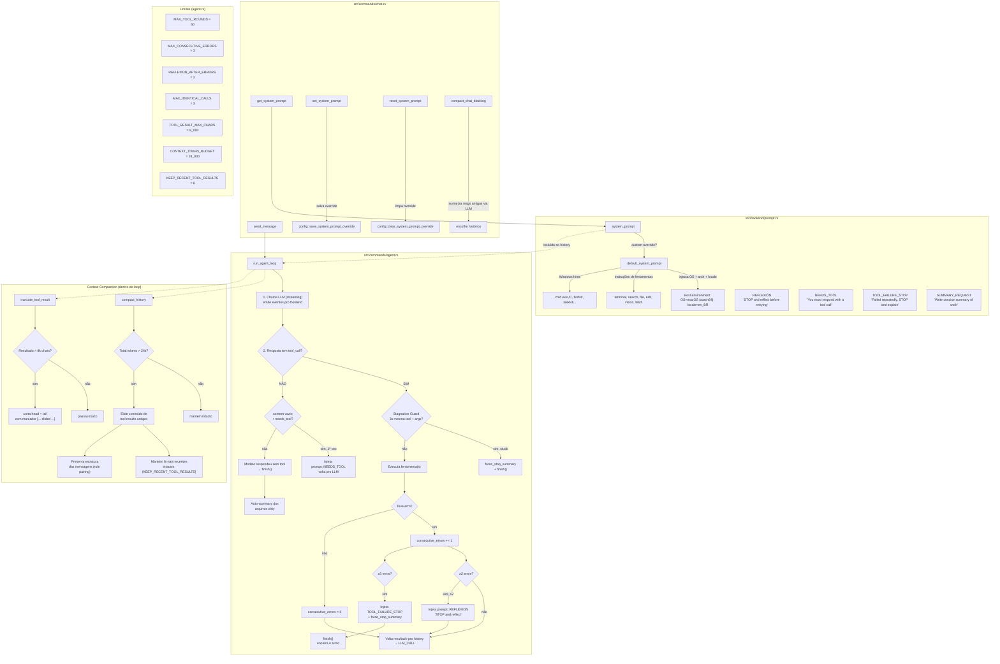

# Prompt & Reflection System — Architecture

## Fluxo resumido

1. **`chat.rs`** recebe o comando do usuário (`send_message`) e chama `run_agent_loop()`
2. **`run_agent_loop()`** monta o history com o system prompt (`prompt::system_prompt()`) + mensagens anteriores + mensagem do usuário
3. Loop principal:
   - Chama o LLM (streaming), emite eventos pro frontend
   - Se o modelo **chamou ferramenta(s)**:
     - Stagnation guard: se 3x mesma chamada → para
     - Executa as ferramentas, trunca resultados > 8k chars
     - Se deu erro: reflection após 2 erros, hard stop após 3
     - Volta pro LLM com o resultado das tools
   - Se o modelo **não chamou ferramenta**: finish() + auto-summary
4. **Context compaction** acontece entre rounds quando o histórico estimado > 24k tokens
5. O usuário pode customizar o system prompt via `set_system_prompt()` (que persiste um override no config)